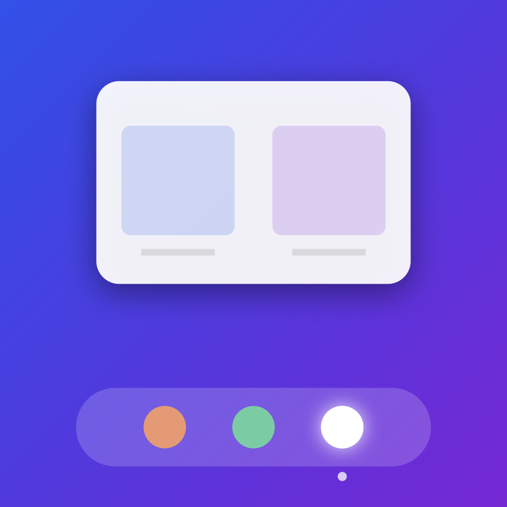

# PeekDock

**Instant window previews from your macOS Dock.**

Hover any app icon in the Dock and a floating panel appears showing live thumbnails of every open window for that app. Click a thumbnail to switch to it — just like Windows taskbar previews, but on macOS.



> **Download** → [peekdock.developerpritam.in](https://peekdock.developerpritam.in)

---

## Features

- **Hover to preview** — panel appears on Dock hover, disappears when you move away. No clicking required.
- **Multi-window grid** — apps with many windows show a 4-column grid (up to 3 rows), with vertical scroll if needed.
- **All window types** — shows on-screen, minimized, and off-screen windows (including windows on other Spaces).
- **One-click focus** — click any thumbnail to bring that exact window to the front.
- **Permissions dashboard** — a status window on every launch shows permission health and explains what each permission is for.
- **Zero CPU at idle** — driven by Accessibility events, not mouse polling.
- **Privacy first** — no network calls, no telemetry, no analytics. All thumbnail captures are in-memory only.

---

## Requirements

- macOS 14 Sonoma or later
- Apple Silicon or Intel Mac

---

## Permissions

PeekDock needs exactly two permissions:

| Permission | Why |
|---|---|
| **Accessibility** | Detects which Dock icon you are hovering using the macOS Accessibility API. Without this the preview panel cannot appear. |
| **Screen Recording** | Captures live thumbnail images of each window using Apple's ScreenCaptureKit. Frames are rendered in-memory and never saved or transmitted. |

The app guides you through granting both on first launch.

---

## Installation (pre-built)

1. Download `PeekDock-<version>.zip` from the [Releases](../../releases) page.
2. Unzip and drag **PeekDock.app** to `/Applications`.
3. **Right-click → Open** on first launch to bypass the Gatekeeper warning (unsigned app).
4. Grant Accessibility and Screen Recording permissions when prompted.
5. A PeekDock icon appears in your menu bar. Hover any Dock icon to use it.

To uninstall: quit from the menu bar icon, then move `PeekDock.app` to Trash.

---

## Building from source

**Prerequisites:** Xcode 15+, [xcodegen](https://github.com/yonaskolb/XcodeGen)

```bash
# Install xcodegen if needed
brew install xcodegen

# Clone and build
git clone https://github.com/YOUR_USERNAME/peekdock.git
cd peekdock
xcodegen generate
open PeekDock.xcodeproj
```

Build and run from Xcode (⌘R). Grant permissions when prompted.

### Release build (unsigned zip)

```bash
./scripts/build-release.sh
# Output: dist/PeekDock-1.0.zip
```

### Regenerate app icon

```bash
swift scripts/generate-icon.swift
```

---

## Project structure

```
PeekDock/
├── WindowManager/                    # All Swift source (folder name is historical)
│   ├── App/
│   │   ├── AppDelegate.swift         # App entry, wires all services, status bar
│   │   └── main.swift                # NSApplication setup
│   ├── Utilities/
│   │   ├── DockObserver.swift        # AXObserver on Dock process — hover detection
│   │   ├── DockUtils.swift           # CoreDock orientation (bottom/left/right)
│   │   └── PrivateApis.swift         # CGS, SkyLight, CoreDock private API declarations
│   ├── WindowManagement/
│   │   ├── WindowInfo.swift          # Window model + bringToFront()
│   │   └── WindowUtil.swift          # SCK enumeration, thumbnail capture, cache
│   ├── Views/
│   │   ├── PreviewPanelCoordinator.swift  # NSPanel lifecycle + positioning
│   │   ├── PreviewContentView.swift       # Grid layout of thumbnails
│   │   ├── ThumbnailView.swift            # Single thumbnail cell
│   │   └── WelcomeWindow.swift            # Permissions & about window
│   ├── Extensions/
│   │   └── AXUIElement+Helpers.swift      # AX attribute wrappers
│   └── Assets.xcassets/
├── docs/                             # GitHub Pages website
├── scripts/
│   ├── build-release.sh              # Clean release build → zip
│   └── generate-icon.swift           # Generates app icon PNGs programmatically
└── project.yml                       # XcodeGen spec
```

---

## How it works (technical)

**Hover detection** — `DockObserver` attaches an `AXObserver` to the Dock process and subscribes to `kAXSelectedChildrenChangedNotification` on the Dock's list element. When the notification fires, it reads `kAXSelectedChildrenAttribute` to find the hovered item, filters for `AXApplicationDockItem` subrole, then resolves the app bundle URL to an `NSRunningApplication`.

**Window enumeration** — `WindowUtil` calls `SCShareableContent.excludingDesktopWindows` to find on-screen windows, and supplements with a brute-force AX token scan (iterating AX element IDs with a known magic value) to find minimized and off-screen windows.

**Thumbnails** — `SCScreenshotManager.captureImage(contentFilter:configuration:)` captures each window using `SCContentFilter(desktopIndependentWindow:)`. A CGS private API (`CGSHWCaptureWindowList`) is used as a fallback.

**Focusing** — `WindowInfo.bringToFront()` chains: Carbon `GetProcessForPID` → SkyLight `_SLPSSetFrontProcessWithOptions` (loaded via `dlopen`) → `kAXRaiseAction` → `kAXMainWindowAttribute`, with up to 3 retries.

**Panel** — An `NSPanel` with `.nonactivatingPanel | .fullSizeContentView | .borderless` style, at `.statusBar` window level, hosts the SwiftUI grid via `NSHostingView`. It appears without stealing focus from the frontmost app.

---

## Acknowledgements

Inspired by [DockDoor](https://github.com/ejbills/DockDoor) by ejbills and [AltTab](https://github.com/lwouis/alt-tab-macos) by lwouis — both excellent open-source macOS utilities whose public code was studied as reference for private API patterns.

---

## License

MIT License — see [LICENSE](LICENSE) for details.

---

<br />

> **A note on how this was built**
>
> This project was built almost entirely with the assistance of [Claude Code](https://claude.ai/code) (Anthropic's AI coding agent). The architecture, all Swift source files, the SwiftUI views, private API integrations, the icon generator script, the landing page, and this README were written by AI with the developer steering direction and making product decisions.
>
> This is an experiment in AI-assisted native macOS development. The code works, the patterns are real, and the private APIs are correctly used — but a significant portion of the credit belongs to the model that wrote it. That feels worth saying out loud.
>
> Built by [Pritam](https://developerpritam.in) · [Buy me a coffee](https://developerpritam.in/donate)
